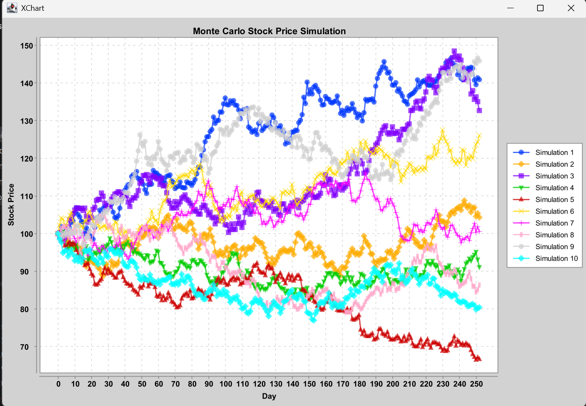

# Monte Carlo Stock Simulator
A Java project that explores quantitative finance through Monte Carlo simulation.
## Motivation
I built this project to learn how stochastic simulations are used in finance and to strengthen my understanding of Probability and Statistics
## Objectives
- Practice clean Java design
- Simulate stock price movements
- Compute basic financial risk metrics
- Document the development process
## Planned Features
- Simulate one trading day
- Simulate one stock price path
- Simulate thousands of paths
- Calculate expected return
- Calculate volatility
- Calculate Value at Risk (VaR)

## Sample Simulation

The figure below shows several simulated stock price paths generated using the Monte Carlo simulation. Each line represents a different possible future outcome for the same stock, demonstrating how uncertainty causes prices to diverge over time.

